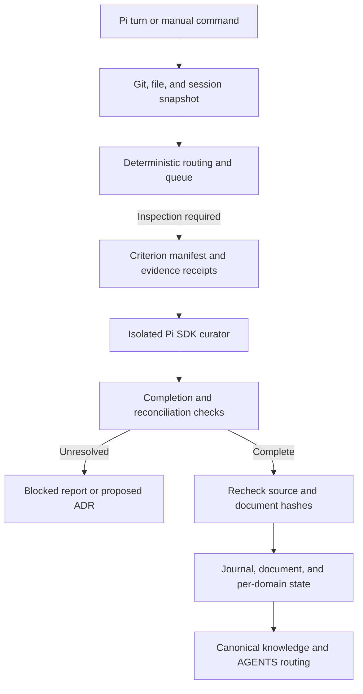

# Architecture and implementation decisions

## Data flow

## Components

| Module | Responsibility |
| --- | --- |
| `collector.mjs` | Git-safe argument handling; bounded working/index/HEAD evidence; session ingestion; file fingerprints; lexical and history signals |
| `router.mjs` | Independent per-domain freshness, named trigger reasons, criterion expansion, aging, retries, budgets |
| `investigation.mjs` | Required/derived work queue, inspected evidence receipts, completion validation, exact-patch reconciliation |
| `pi-sdk.mjs` | Actual Pi SDK sessions, resource isolation, five investigation tools, timeout/cancellation, usage |
| `store.mjs` | Single-writer lock, atomic file replacement, write-ahead recovery, stale-process unlock |
| `engine.mjs` | Orchestration, source-drift rejection, reports, successful baseline advancement, AGENTS routing |
| `extension.ts` | Pi commands and lifecycle hooks, session capture, opt-in background execution |
| `cli.mjs` | JSON output for shell/CI and explicit session import |

## Decisions from the design discussion

1. **The identifier is deterministic.** No model decides whether another model should run. File existence, registry content, fingerprints, path rules, lexical signatures, and history are ordinary code.
2. **Inspection is not modification.** All five routing statuses remain distinct from `updated`, `no_change`, `blocked`, and `failed` investigation results.
3. **Freshness belongs to a domain.** Every document has its own source inventory, input hash, output hash, rule hash, Git anchor, processed session-entry hashes, and report reference. A failed security investigation cannot make security current because another curator succeeded.
4. **Content is primary.** Git commits are diagnostic/traversal anchors. Head/index/file object identities cover dirty trees, staged-only changes, deletes, new files, and metadata-only rebases/commits without filesystem timestamps.
5. **Criteria are versioned data.** The registry contains 138 domain criteria, eight common criteria, baseline mappings, and named trigger-to-check relationships. Hashing the actual registry avoids relying solely on a manually bumped version number.
6. **Investigation is an auditable work queue.** Evidence receipts, concise outcomes, parented derived checks, and semantic classifications are retained. No hidden reasoning transcript is requested or stored.
7. **Uncertainty stays unresolved.** A terminal insufficient-evidence finding finishes the attempt but does not finish freshness. The queue retains it for later retry. Session watermarks advance only for fully read entries in successful jobs.
8. **Human documents are evidence.** Manual edits route reconciliation. Existing content is patched by exact match. Source and all canonical documents must still match the inspected snapshot before committing.
9. **Only the host writes.** Curators cannot directly edit code, state, policy, or documents. An isolated SDK session cannot reload this extension and recursively spawn curators.
10. **Decisions remain decisions.** Clear violations require remediation; architectural tradeoffs can produce proposed ADRs; unaccepted suggestions do not become policy. The curator cannot approve its own ADR.

## Completion contract

A successful job requires every mandatory and derived criterion to have an explicit supported outcome; canonical-impact findings must be handled; required evidence must be read; unresolved conflicts and essential evidence gaps must be absent; and the proposal must pass source/document drift checks.

Outcome meanings:

| Criterion outcome | Canonical effect |
| --- | --- |
| `no_finding`, `not_applicable` | No patch; evidence and rationale required |
| `finding` | Retained in audit; no durable document change |
| `update`, `cleanup` | Must map to a proposed canonical patch or missing-document creation |
| `conflict` | Attempt blocked; classified as violation, tradeoff, or open question |
| `adr_candidate` | Attempt blocked; proposal must include context and alternatives |
| `insufficient_evidence` | Attempt blocked; no fabricated freshness |

Evidence receipts demonstrate what was available and read. Mechanical validation cannot establish whether the model's conclusion is true. Semantic quality still depends on the selected model and review of representative reports.

## Transaction protocol

The extension acquires a repository lock, recovers any journal, snapshots state, and runs curators sequentially. Each curator gets a fresh canonical-document snapshot so a preceding curator's changes are visible.

After successful investigation, the engine rereads repository identities and canonical documents. If unchanged, it writes a journal containing expected document/state hashes and desired values. Recovery writes the document and state idempotently, records the committed report, and removes the journal. Interruption before state advancement never silently reports the new source as inspected. An unexpected manual edit stops recovery.

Atomic replacement and process locking provide practical crash recovery, not a distributed transaction with every external editor. Directory metadata is not explicitly fsynced, so sudden power-loss durability also depends on filesystem guarantees. The supported target is local Git working trees, not shared multi-host network filesystems.

## Extension points

Adapt the registry's input paths and named mappings for repository layout. Keep each domain's input surface broad enough to catch relevant changes. An added path trigger should also be represented in `inputPaths`.

To introduce an AST or graph detector, add a deterministic signal in `collector.mjs`, map its changes through `router.mjs`, add it to registry validation, and add fixture tests. Keep detector evidence distinct from semantic conclusions. The existing criteria for cycles, complexity, and duplication can then consume mechanically derived facts.

The programmatic `run(cwd, options)` accepts an injected curator for deterministic testing and a `modelRuntime` for an embedded Pi integration. Production behavior uses `runPiCurator` when no curator is injected. Injected curators must complete the same `Investigation` methods and cannot bypass host write validation.
