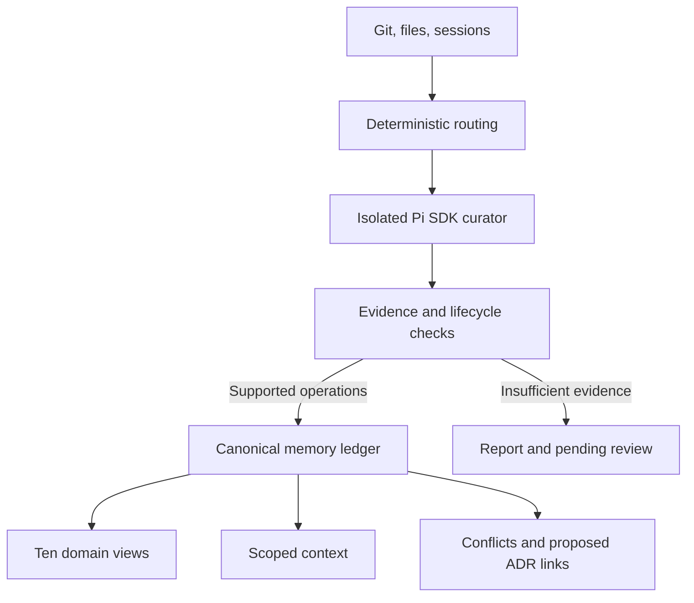

# Architecture · v0.2.0

## Canonical memory

The ledger, schema version 1, contains `revision`, `records`, `events`, `imports`, and `projections`. Its file is `.agents/curation/memory.json`. Package version 0.2.0, config/state/ledger schema versions, view version, and report version are separate concepts. Reports and new transaction journals use version 2; config, registry, state, and ledger use version 1.

Records carry host-generated IDs, revisions, kinds, domains, one-paragraph statements, scope, lifecycle status, confidence, observed/policy/inferred basis, provenance, timestamps, projection names, and supersession/contradiction links. Scars add reason, constraint, removal condition/signals, and scar state. Conflicts add target IDs and reason. Imported records carry archive references and a required scope-review flag.

Scope explicitly chooses `global: true` with empty selectors, or `global: false` with at least one path/symbol/concept selector. Paths use the existing small glob language. Exact symbols and case-insensitive exact concepts avoid accidental substring matches. Scope selectors are alternatives, not intersections.

## Modules

| Module | Responsibility |
| --- | --- |
| `collector.mjs` | Bounded Git/worktree/session/history snapshots; ledger and migration evidence |
| `session-normalizer.mjs` | Pure Pi/Muse session normalization: user-anchored episodes, compact tool summaries |
| `muse-adapter.mjs` | Pure Muse Code envelope parsing into Pi entry shape; bodies discarded |
| `muse-import.mjs` | Run-time Muse pull: discovery, sequence cursors, repo filtering, char budget |
| `git-evidence.mjs` | Pure commit serialization, history range selection, surface filtering |
| `bundles.mjs` | Deterministic virtual code/prose/session/git coverage evidence, sharded into parts |
| `router.mjs` | Per-domain freshness, criterion expansion, scar/conflict triggers, queue |
| `investigation.mjs` | Findings, evidence receipts, completion and provenance gates |
| `memory.mjs` | Schema validation, pure lifecycle reconciliation, retrieval |
| `views.mjs` | Deterministic domain Markdown, AGENTS block, context display |
| `migration.mjs` | Exact original backups and unverified import candidates |
| `pi-sdk.mjs` | Real Pi SDK integration, isolated sessions, schemas, in-run cancellation |
| `daemon.mjs` | Detached background runs, cross-process cancel/status, per-run logs |
| `store.mjs` | Locking, atomic file replacement, journal recovery |
| `engine.mjs` | Orchestration, drift guards, commits, baseline advancement |
| `commands.mjs`, `cli.mjs`, `extension.ts` | Argument parsing, CLI, Pi commands and events |

## Investigation contract

The registry retains 138 domain criteria and eight common criteria. A ninth common obligation, `MEMORY-RECONCILE-001`, is added when a ledger exists. The tool surface is exactly `list_investigation`, `read_evidence`, `add_check`, `resolve_check`, and `submit_investigation`.

Successful submissions require all required/derived criteria resolved, the manifest and memory index read fully, every available domain view read fully, and differing index/HEAD evidence read fully. Complete-survey jobs also expose whole-repository `bundle:code` and `bundle:prose` virtual evidence; jobs with pending session episodes expose `bundle:sessions`, and jobs with selected history expose `bundle:git`. Every available required bundle part must be read fully; large bundles shard into numbered parts at item boundaries under `maxCoverageBundleChars` per part and `maxCoverageBundleParts` parts, while oversized bundles report `unavailable_too_large` instead of truncating. When a session bundle is available, atomic session messages only need reading when cited as provenance; otherwise every supplied new session entry must be read fully. Code/prose bundles are derived only from collector-approved readable current working-tree evidence, so they do not bypass sensitive/binary/size exclusions or reread the filesystem. Each changed readable working file requires at least one inspected chunk; the curator must follow relevant symbols and further chunks as needed. Target memories must be read fully before changes. Imported claims require the original archive fully read before reinforcement or replacement.

`update` and `cleanup` findings must map to operations. `reinforce` can also cite `finding` or `no_finding`; `conflict` operations cite conflict/ADR outcomes. Every operation cites receipts used by its resolved criteria. Coverage bundles are survey/navigation evidence only: `bundle:*` receipts are rejected as durable provenance, so a claim discovered in a bundle must cite its original atomic evidence such as `file:path`, `session:s1:u17`, or `git:<oid>`. Session archives keep every atomic message plus compact tool summaries as provenance-addressable evidence; Git commits are addressable as `git:<oid>` with provenance type `history`. Existing memories alone cannot provide fresh evidence. The host computes provenance type, actual session role, content hash, character offsets, report path, and accepted-ADR metadata.

Accepted ADR evidence requires `status: accepted` in initial YAML frontmatter or a `Status: Accepted` line among the first 12 lines, under `.agents/decisions/` or `docs/adr/`. The check must also classify the evidence as a decision, constraint, or reversal. The agent still determines whether the content is relevant and current. A word in ordinary prose cannot establish acceptance.

Blocked submissions may persist only conflicts. Open conflicts remaining in the domain also block success, even if a model reports `no_change`. ADR proposals require alternatives, relevant criterion IDs, and durable conflict references. They stay in reports and are never automatically accepted or published as decision files.

## Reconciliation and confidence

`reconcile` validates and clones its input, then applies create/scar, reinforce, supersede, invalidate, conflict, and resolve operations in that fixed order. Every batch either returns a fully validated proposal or throws without changing its input. `clientId` references link newly proposed conflicts to ADR candidates. Supersession links must be acyclic.

Evidence-derived confidence distinguishes authority from observation. Only actual user decisions and explicitly accepted ADRs confer policy authority. Assistant and tool session evidence never confers authority. Historical `history` evidence alone stays `inferred`: an old commit records what someone changed and wrote at the time, not that the rationale remains current; corroborating current source can supply the stronger basis. Independent evidence counts unique source paths, not multiple Git layers or chunks of the same file. Reinforcement combines evidence. Model check confidence does not become ledger confidence.

Deduplication uses normalized text with case/negation/punctuation preserved, canonical scope, kind, basis, and scar fields. Exact duplicates can merge domain projections. Near matches require explicit review. No similarity score automatically changes a policy.

Superseded/resolved/obsolete records remain as tombstones. Audit events store a before hash and complete resulting record with evidence and reason. Reinforcement timestamps and receipt accumulation do not change semantic memory fingerprints. Semantic status, scope, statement, links, and projection changes do.

Conflicts inherit the union of target scopes so disputed knowledge cannot disappear without a retrievable warning. Their target claims become `conflicted`. Resolution `keep` restores a target only after its other conflicts close; resolution `retired` requires all targets already superseded/retired. Targetless open questions require authoritative resolution evidence. Policy targets require authoritative evidence to replace, retire, or restore.

## Routing and context

Memory scope paths and source provenance supplement the registry's source surface. Session-backed records enable session routing in their domains. Sessions route as normalized user-anchored episodes rather than isolated messages; successful investigations acknowledge only the completed episode batch, and oversized episodes stay pending instead of being silently skipped. Git history contributes a bounded commit window (not complete reachable history) with per-patch safety filtering; the domain fingerprint covers the window selection for its surface, and a baseline that is no longer an ancestor reports `history_diverged` with a bounded fallback survey. Shared changes queue affected siblings without advancing those siblings' source or semantic-memory baselines.

Newly expanded source surfaces are acknowledged immediately only if the added available evidence was fully inspected. Otherwise a later review is retained. Scar path signals are evaluated against the collected inventory and surfaced as `removalCandidates`; they do not mutate a scar's stored state or prove business compatibility. Explicit evidence-backed invalidation resolves a scar.

Retrieval selects active matching records, prioritizing conflicts, scars, constraints, invariants, decisions, contracts, then conventions. Stable ID sorting breaks ties. The budget measures serialized selected record characters, excluding response wrappers and omission metadata; it is not a strict token limit. Omissions and pending-domain warnings are explicit. Views additionally label unverified and disputed claims so they remain available for review.

## Transaction protocol

1. Acquire the repository lock and recover any interrupted journal, including old v1 journals.
2. Snapshot evidence and state; run one curator at a time with fresh cross-domain evidence.
3. Validate operations; check source/session, ledger, views, state, config, and registry for drift.
4. Render views and projection hashes. Preserve AGENTS text outside its managed block.
5. Write a v2 journal with expected hashes and desired contents for every target: ledger, views, AGENTS, state, and migration originals.
6. Preflight every target against its old or already-written new hash before replaying anything. Atomically replace pending files, record the committed report, then remove the journal.

Readers refuse pending journals. Any unexpected external edit stops recovery. A blocked job that records no conflict writes only queue/report state. A blocked job that records conflicts commits their views but preserves source/session/semantic inspection baselines. Successful `no_change` still advances the inspected baseline.

The protocol is recoverable, not a simultaneous multi-file rename. Unrelated filesystem readers may observe intermediate files; arbitrary editors do not honor the lock. Small external check/write races, power-loss directory durability, and shared-network-filesystem guarantees are outside the tested contract.

## Migration and extensibility

Migration archives changed originals, splits simple paragraphs/top-level list items, and creates unverified convention candidates with provisional global scope. It does not claim semantic decomposition. Exact previously rendered entries are skipped; same wording from different legacy domains retains applicability. Repeated unchanged migration is a no-op. Promotion requires explicit scope/atomicity review plus current evidence; correcting a kind or statement uses supersession.

The full ledger cap includes audit events and retired records. There is no lossy automatic pruning. Future archival should preserve stable IDs, provenance availability, and link resolution before splitting the ledger.

Registry paths and deterministic detectors remain the extension points for language-specific AST/graph analysis. `run(cwd, options)` permits injected curators for tests and `modelRuntime` for embedded Pi integrations; injected curators must satisfy the same investigation contract. No alternate agent SDK is used.
